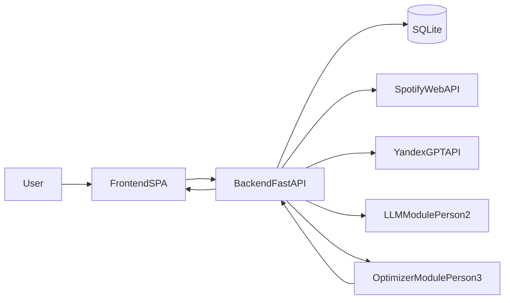

# План: рабочая локальная версия проекта

## Цель
Собрать и запустить локально end-to-end версию: backend API + часть 3 (Spotify интеграция и оптимизатор) + БД + подключение YandexGPT/Spotify + базовый frontend-клиент для проверки полного потока.

## Обязательное условие
- Реальные интеграции используются по умолчанию.
- Если реальные YandexGPT/Spotify недоступны (нет ключей, сетевые ошибки, rate limit, сбой провайдера), система автоматически переключается на fallback mock API, чтобы локальная разработка и smoke-тесты оставались рабочими.

## Итоговый поток (должен работать локально)

## 1) Подготовка к merge и выравнивание frontend + llm-backend
1. Зафиксировать интеграционную ветку (рекомендация: `develop`) и правило merge на этапе стабилизации.
2. Сверить текущие изменения с:
   - `README.md`
   - `DEV_PLAN_PERSON1_FRONTEND.md`
   - `DEV_PLAN_PERSON2_LLM_BACKEND.md`
3. Утвердить минимальный контракт перед merge:
   - frontend использует `/api/v1/...`, а не `localStorage` как основной путь;
   - llm-backend отдает стабильный сервисный интерфейс для оркестрации;
   - единый формат DTO, статусов и ошибок.
4. Подключить quality gates перед merge: lint, unit, integration smoke.

## 2) Создание маршрутизации и внутрипроектного API
1. Поднять backend-каркас (FastAPI) с префиксом `/api/v1`.
2. Реализовать маршруты:
   - Auth: `/auth/spotify/login`, `/auth/spotify/callback`, `/auth/logout`, `/me`
   - Chats: `/chats`, `/chats/{id}`, `PATCH /chats/{id}`
   - Messages: `POST /chats/{id}/messages`, `GET /chats/{id}/messages/{msg_id}`
   - Concert: `GET /chats/{id}/concert`, `PATCH /chats/{id}/concert/order`, `GET /chats/{id}/concerts`
   - Pool: `GET /spotify/playlists`, `POST /chats/{id}/pool`, `DELETE /chats/{id}/pool/tracks`, `POST /chats/{id}/generate`
3. Ввести DTO (Pydantic) и OpenAPI как единый контракт frontend/backend.
4. Добавить orchestration pipeline:
   - `parse_intent -> collect_candidates -> tag_tracks -> optimize_order -> persist_concert`.

## 3) Написание части 3-го человека
1. Реализовать Spotify-модуль:
   - OAuth и refresh token;
   - получение профиля, плейлистов, треков, search/recommendations/audio-features.
2. Реализовать сбор пула кандидатов:
   - режимы `fixed_pool` и `spotify_discovery`;
   - дедупликация и лимиты (целевой пул 100-300).
3. Реализовать оптимизатор порядка (simulated annealing + scoring).
4. Реализовать `PATCH /concert/order` с валидацией полного списка `ordered_track_ids`.
5. Сохранять версии концертов: `version`, `order_source`, `spotify_playlist_id`.

## 4) Подъем БД и миграции
1. Поднять SQLite для локальной среды.
2. Создать миграции таблиц:
   - `users`, `chats`, `messages`, `concerts`, `tracks_cache`, `chat_pool_tracks`.
3. Добавить индексы и ограничения:
   - `(chat_id, version)`, `(chat_id, spotify_track_id)` и т.д.
4. Настроить безопасное хранение refresh token (шифрование ключом из env).

## 5) Подключение API YandexGPT и Spotify (real-first + fallback)
1. Реализовать реальный `LLMTransport` для YandexGPT:
   - timeout, retry, jitter, строгий JSON parsing.
2. Реализовать реальный Spotify API-клиент.
3. Ввести provider abstraction с режимами:
   - `real` (по умолчанию),
   - `mock` (fallback или принудительно для тестов).
4. Правила fallback:
   - если отсутствуют ключи или недоступен провайдер -> автоматический переход на mock;
   - возвращать controlled degradation с понятным статусом в API;
   - логировать причину переключения без секретов и PII.
5. Подготовить `.env.example`:
   - `SPOTIFY_CLIENT_ID`, `SPOTIFY_CLIENT_SECRET`, `SPOTIFY_REDIRECT_URI`
   - `YANDEX_*`
   - `APP_BASE_URL`, `DB_PATH`, `CRYPTO_KEY`, `PROVIDER_MODE`.

## 6) Доработка frontend под внутреннее API
1. Перевести фронт с `auth.ts` / `concertMvp.ts`-моков на API-клиент `/api/v1`.
2. Добавить единый HTTP-клиент:
   - обработка `401/403/429/5xx`,
   - единый формат ошибок.
3. Реализовать polling статусов генерации:
   - `queued`, `tagging`, `optimizing`, `done`, `error`.
4. Обеспечить минимальный backend-first поток:
   - login -> chats -> send message -> show concert -> reorder/save.
5. Добавить индикатор источника данных в dev-сборке:
   - `real providers` или `mock fallback`.

## 7) Тестирование компонентов
1. Backend unit:
   - нормализация/валидация LLM, cache miss/hit, spotify adapters, optimizer scoring.
2. Backend integration:
   - `/messages` pipeline, `/generate`, `/concert/order`, auth callback.
3. Frontend integration/e2e smoke:
   - сценарий: вход -> чат -> генерация -> сохранение порядка.
4. Контрактные тесты DTO:
   - совместимость schema frontend/backend.
5. Отдельные тесты fallback:
   - запуск без ключей;
   - имитация отказа YandexGPT/Spotify;
   - проверка автоматического переключения на mock без падения флоу.

## 8) Подъем всего проекта локально
1. Подготовить `docker-compose`:
   - `api`,
   - volume для SQLite,
   - (опционально) frontend dev/nginx.
2. Добавить команды запуска:
   - `docker compose up --build`,
   - запуск тестов backend/frontend,
   - smoke-скрипт.
3. Добавить runbook в `README.md`:
   - заполнение `.env`,
   - запуск,
   - проверка health/smoke,
   - поведение fallback mock режима.

## 9) Финальный merge-ready чеклист
- API эндпоинты соответствуют `README.md`.
- Frontend работает с `/api/v1` (локальные моки не основной путь).
- Pipeline (LLM + часть 3 + БД) проходит integration tests.
- Fallback на mock API работает автоматически при недоступности YandexGPT/Spotify.
- Проект поднимается локально одной командой и это задокументировано.

## Критический порядок выполнения
1. Пункты 2-4 (API + часть 3 + БД)
2. Пункт 5 (реальные интеграции + fallback mock)
3. Пункт 6 (перевод frontend на API)
4. Пункт 7 (тесты)
5. Пункты 8-9 (локальный запуск и merge-ready)
